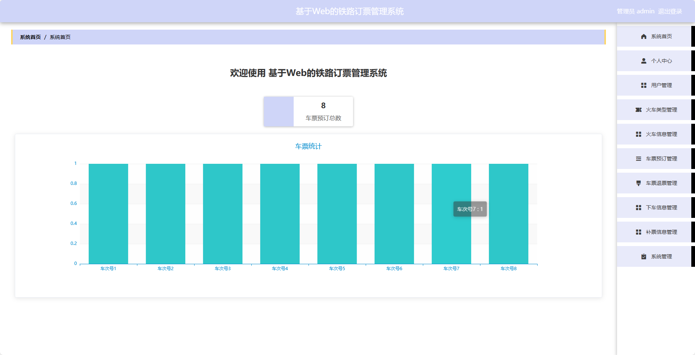
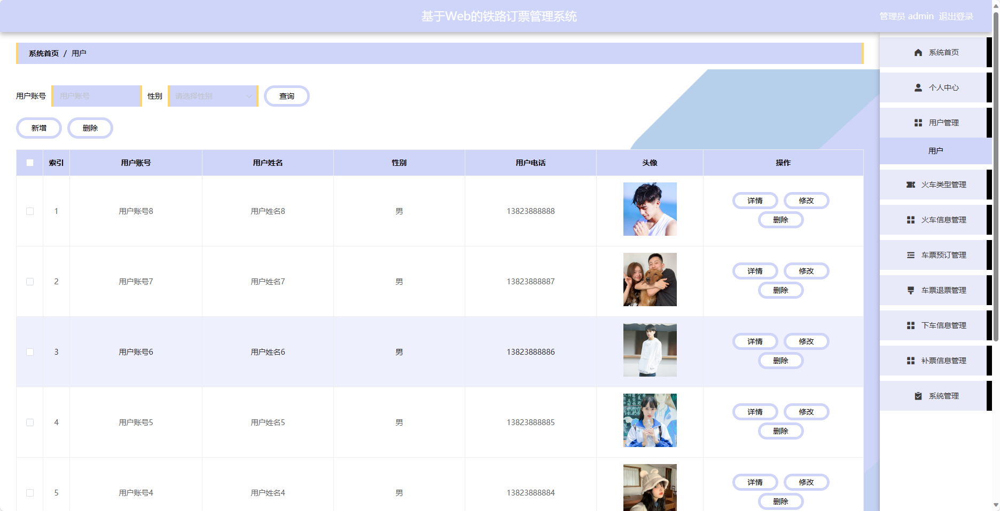
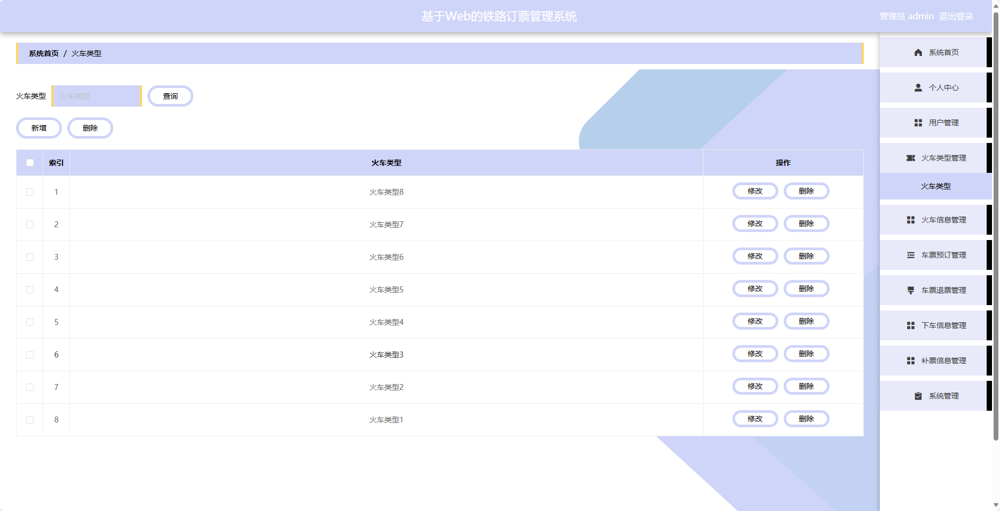
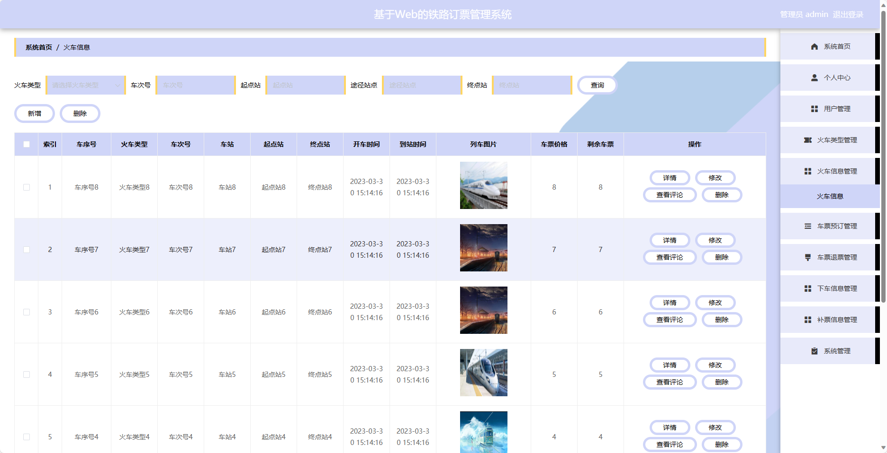
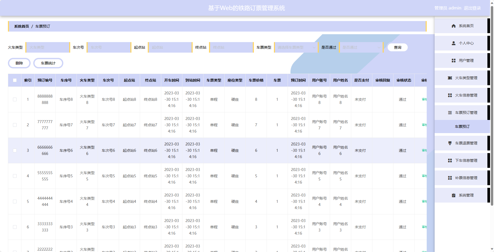
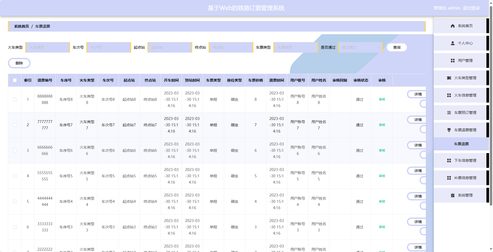
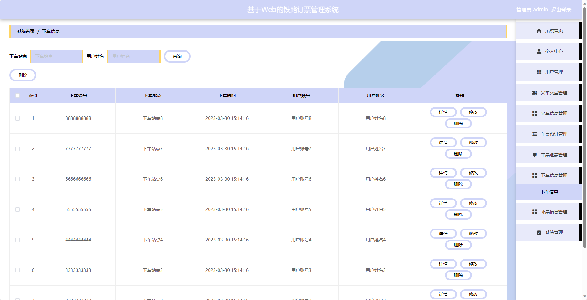
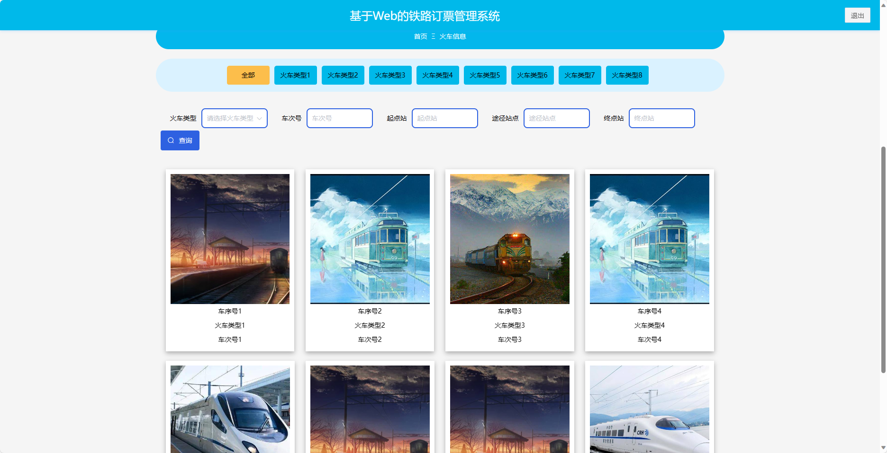
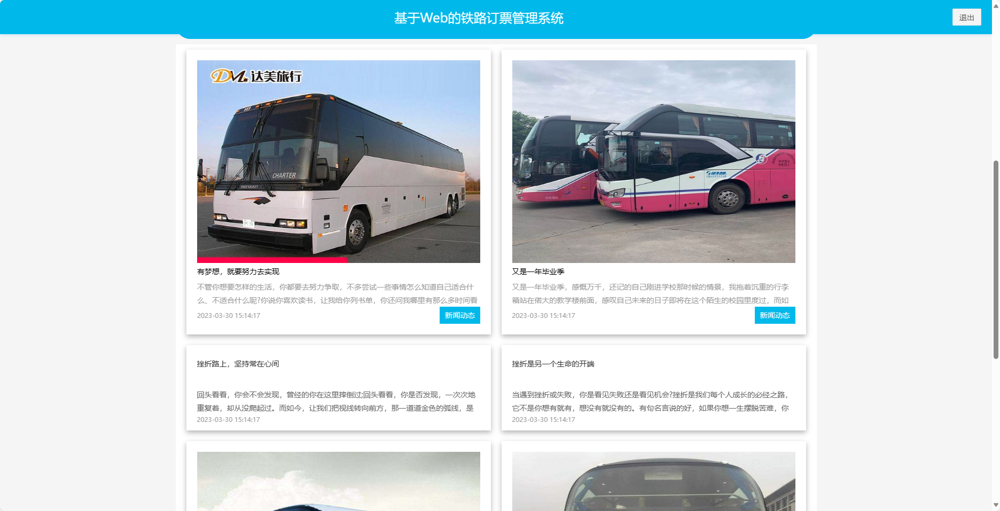

## 基于SpringBoot的铁路订票管理系统

###  获取sql数据库文件: 从戎源码网 (https://armycodes.com/) QQ: 386869957 QQ群: 377586148
###  所有系统地址: (https://github.com/YuLin-Coder/AllProjectCatalog) 
###  所有项目以及源代码本人均调试运行无问题 可支持远程安装部署调试、定制修改、代码讲解

## 项目介绍
基于SpringBoot的铁路订票管理系统，系统包含两种角色：管理员、用户,系统分为前台和后台两大模块，主要功能如下。

### 【管理员】:
1. 管理员个人中心：管理员可以管理个人信息，包括修改密码等操作。
2. 用户管理：管理员可以管理用户信息，包括查看用户列表、禁用用户等操作。
3. 火车类型管理：管理员可以管理火车的类型信息，包括添加、编辑、删除等操作。
4. 火车信息管理：管理员可以管理火车的具体信息，包括添加、编辑、删除等操作。
5. 车票预订管理：管理员可以查看用户的订票信息，包括审核、取消等操作。
6. 车票退票管理：管理员可以处理用户的退票申请，包括审核、处理等操作。
7. 下车信息管理：管理员可以查看用户的下车信息，包括审核、处理等操作。
8. 补票信息管理：管理员可以处理用户的补票申请，包括审核、处理等操作。
9. 系统管理：管理员可以管理系统的参数设置、日志查看等功能。

### 【用户】:
1. 个人中心：用户可以管理个人信息，包括修改密码、查看订单历史等操作。
2. 车票预订管理：用户可以查询车次信息，选择座位并进行订票操作。
3. 车票退票管理：用户可以申请退订车票，进行退票操作。
4. 下车信息管理：用户可以填写下车信息，如下车时间、下车地点等。
5. 补票信息管理：用户可以填写补票信息，如车票遗失补办等。

### 【前台】:
1. 首页：展示最新公告、火车信息等。
2. 火车信息：展示火车时刻表、票价等信息。
3. 公告资讯：展示最新的通知、公告等信息。
4. 个人中心：用户可以管理个人信息，包括修改密码、查看订单历史等操作。

## 项目技术
- 编程语言：Java
- 数据库：MySQL
- 项目管理工具：Maven
- 前端技术：HTML、CSS、JavaScript、Jquery、Vue
- 后端技术：Spring、SpringMVC、MyBatis

## 运行环境
- JDK版本：JDK1.8及以上
- 开发工具：IDEA、Ecplise、Myecplise都可以
- 数据库: MySQL5.7及以上
- Maven：maven3.0及以上
- Node：14.14.0及以上

## 运行截图

